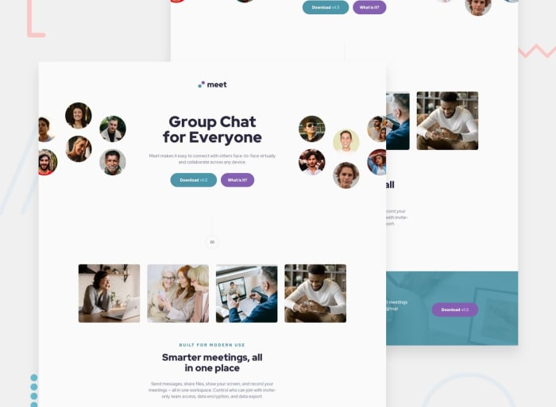

# Meet Landing Page

A modern, responsive landing page for a video conferencing application built with React and Vite.

## Welcome! 👋

This project is a Frontend Mentor challenge solution that recreates a professional landing page with a focus on responsive design and interactive user experiences.

### 🌐 **Links**
- 🔗 [GitHub Repository](https://github.com/sukanyagurav/Frontend-Mentor---Meet-landing-page)
- 🚀 [Live Demo](https://meet-landing-page-5867.netlify.app/)

---

## ⚡ Tech Stack

<div align="center">


</div>

---

## 📋 Project Overview

This landing page showcases a modern design for a video conferencing platform with:
- Eye-catching hero section with clear call-to-action
- Feature highlights demonstrating key benefits
- Responsive layout that looks great on all devices
- Interactive elements with smooth hover states

---

## ✨ Features

- **✅ Responsive Design**: Seamlessly adapts to desktop, tablet, and mobile devices
- **✅ Interactive Elements**: Smooth hover effects and transitions throughout
- **✅ Modern Aesthetics**: Clean, professional design following current web standards
- **✅ Optimized Performance**: Built with Vite for fast development and production builds
- **✅ Semantic HTML**: Proper structure for accessibility and SEO

---

## 🚀 Getting Started

### Prerequisites
- Node.js (v14 or higher)
- npm or yarn

### Installation

1. **Clone the repository**
   ```bash
   git clone https://github.com/sukanyagurav/Frontend-Mentor---Meet-landing-page.git
   cd meet_landing_page
   ```

2. **Install dependencies**
   ```bash
   npm install
   ```

### Available Scripts

- **`npm run dev`** - Start the development server (Vite)
- **`npm run build`** - Build for production
- **`npm run preview`** - Preview the production build
- **`npm run lint`** - Run ESLint to check code quality

---

## 📁 Project Structure

```
meet_landing_page/
├── public/
│   ├── assets/
│   │   ├── desktop/
│   │   ├── mobile/
│   │   └── tablet/
│   └── _redirects
├── src/
│   ├── components/
│   │   ├── Banner.jsx
│   │   ├── Feature_1.jsx
│   │   └── Footer.jsx
│   ├── App.jsx
│   ├── index.css
│   └── main.jsx
├── index.html
├── package.json
├── vite.config.js
└── README.md
```

---

## 💻 Development

1. **Run development server**
   ```bash
   npm run dev
   ```
   The app will be available at `http://localhost:5173`

2. **Make your changes** in the `src/` directory

3. **Hot Module Replacement (HMR)** automatically reloads changes

4. **Build for production**
   ```bash
   npm run build
   ```

---

## 🎨 Responsive Breakpoints

The design is optimized for:
- **Mobile**: Devices below 768px
- **Tablet**: Devices between 768px and 1024px
- **Desktop**: Devices above 1024px

---

## 📦 Deployment

This project is deployed on **Netlify**. To deploy your own version:

1. Build the project: `npm run build`
2. Connect your GitHub repository to Netlify
3. Set build command: `npm run build`
4. Set publish directory: `dist`

---

## 📸 Preview



---

## 👨‍💻 Author

**Sukanya Gurav**
- 🔗 [Frontend Mentor Profile](https://www.frontendmentor.io/profile/sukanyagurav)
- 🐙 [GitHub](https://github.com/sukanyagurav)

---